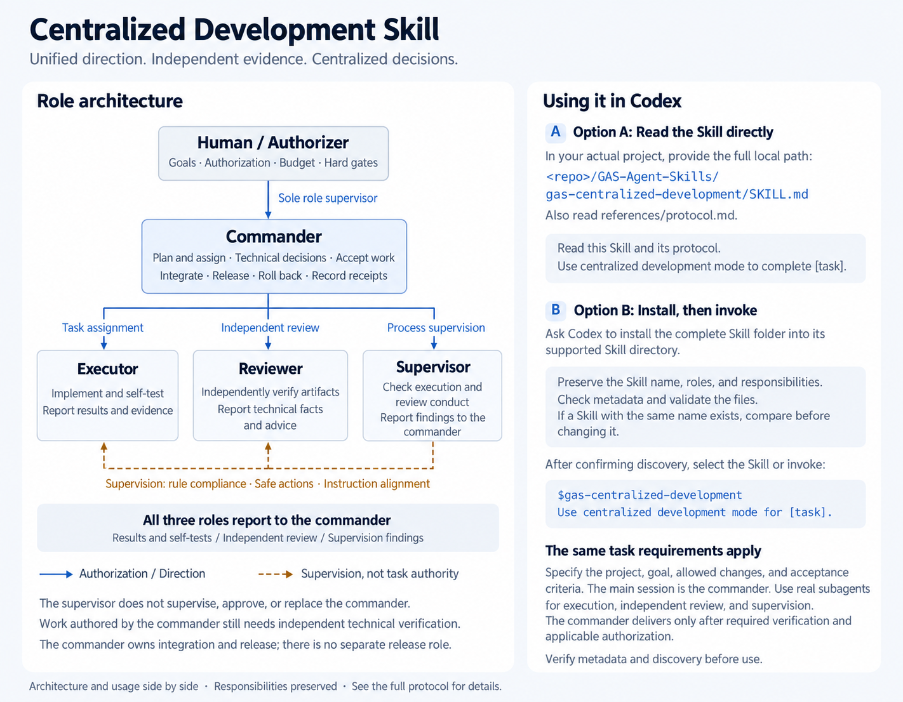
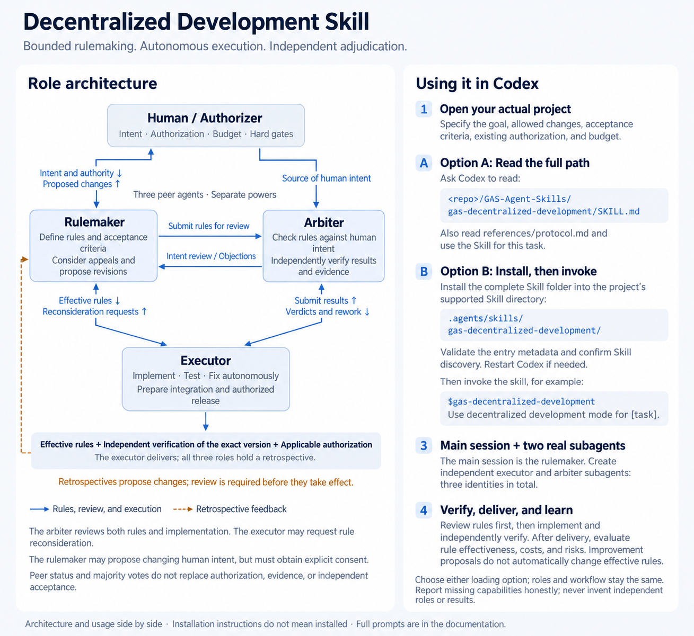
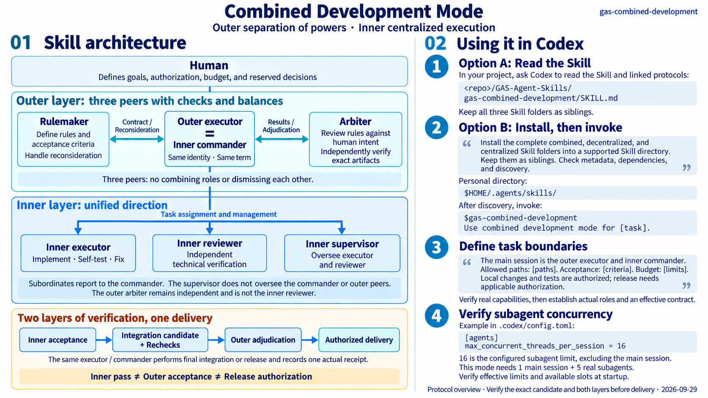

<div align="center">

# GAS · Agent Skills

**[简体中文](README.md) | English**

**Current version: 1.2** · [v1.2](https://github.com/Geruyang/GAS-Agent-Skills/tree/v1.2) · [v1.1](https://github.com/Geruyang/GAS-Agent-Skills/tree/v1.1) · [v1.0](https://github.com/Geruyang/GAS-Agent-Skills/tree/v1.0)

Version 1.2: all three skills require client dialogs for humans to select the model, reasoning effort, and service tier (Default / Fast), then review, edit, and confirm responsibilities before a child agent is created. Allow at least 30 minutes to think and keep waiting without advancing or ending the task if no answer arrives. Preserve pending input across forced host interruptions and resume from that step.

### Give your AI team a clear way to work together.

**Start only when the whole team is ready:** neither the main session nor an early-created child may advance the task until every planned child agent has been created, acknowledged its responsibilities, and reported ready. This covers both layers of combined mode and must be checked again when adding or replacing a member.

**Centralized coordination · Independent checks and balances · Combined governance**

[](https://github.com/Geruyang/GAS-Agent-Skills/actions/workflows/validate.yml)

Three collaboration modes for multi-agent development, with explicit responsibilities, decision boundaries, independent verification, and evidence-based delivery.

[Centralized](#01-centralized-mode) · [Decentralized](#02-decentralized-mode) · [Combined](#03-combined-mode) · [Quick start](#quick-start) · [Contributing](#help-validate-gas-in-real-projects) · [Discussions](https://github.com/Geruyang/GAS-Agent-Skills/discussions)

</div>

> **Validation status: GAS has not yet been sufficiently validated in real engineering projects.** Passing checks currently cover file structure, templates, validators, and installation workflows. They do not establish the effectiveness, efficiency, or reliability of these collaboration modes in real development. Please join us in testing them and share successes, failures, and suggestions.

---

When several agents write code together, who sets the rules? Who assigns tasks? Who decides whether the work is actually finished?

**GAS turns these questions into explicit, reusable development protocols.** Choose centralized coordination, separation of powers, or a combination of both according to your task dependencies and governance needs.

Each mode includes a **Skill entry point, a collaboration protocol, JSON record templates, and pressure-test scenarios**. The repository also provides three architecture diagrams, a copy installer, and offline checks using only the Python standard library. Your agent host must provide file access and real subagents to run the full collaboration modes.

English architecture diagrams are provided below. Detailed Skill protocols are currently in Chinese; links to Chinese documents are labeled where helpful.

## 01 Centralized mode

### One commander connects planning, execution, and delivery.

**Unified direction. Independent evidence. Centralized decisions.** The commander breaks down work, assigns tasks, evaluates technical evidence, and handles integration and release. Executors, reviewers, and supervisors have distinct responsibilities and report to the commander.

[](docs/images/01-centralized-en.png)

**Suggested use cases:** Cross-module refactoring, tightly coupled features, frequently changing shared interfaces, and delivery that needs a single set of priorities.

- **Executors** implement and self-test. **Reviewers** independently verify the artifacts. **Supervisors** check execution and review conduct, including understanding of instructions.
- Work authored by the commander still requires independent technical verification. Management acceptance and actual release are recorded separately.
- Supervisors oversee executors and reviewers. The human is the commander's sole role supervisor.

[Skill (Chinese)](GAS-Agent-Skills/gas-centralized-development/SKILL.md) · [Protocol (Chinese)](GAS-Agent-Skills/gas-centralized-development/references/protocol.md) · [Record templates](GAS-Agent-Skills/gas-centralized-development/templates) · [48 pressure-test scenarios](GAS-Agent-Skills/gas-centralized-development/evals/scenarios.json)

## 02 Decentralized mode

### Three independent roles set rules, implement changes, and judge results.

**Bounded rulemaking. Autonomous execution. Independent adjudication.** The rulemaker defines rules and acceptance criteria. The executor works autonomously within the effective contract. The arbiter independently checks both whether the rules reflect the human's intent and whether the result meets those rules.

[](docs/images/02-decentralized-en.png)

**Suggested use cases:** Tasks with clear boundaries and stable interfaces that need independent acceptance and protection against implementers lowering their own acceptance standards.

- The **rulemaker (立规者), executor (执行者), and arbiter (裁衡者)** are peers. Their powers are **not combined**. This mode has one execution seat, not a pool of parallel executors.
- The executor can request reconsideration of the rules. The arbiter reviews both the rules and the implementation, helping catch cases where correct execution follows the wrong requirements.
- Retrospectives produce proposals for rule changes. Those proposals take effect only through the established review process.

[Skill (Chinese)](GAS-Agent-Skills/gas-decentralized-development/SKILL.md) · [Protocol (Chinese)](GAS-Agent-Skills/gas-decentralized-development/references/protocol.md) · [Record templates](GAS-Agent-Skills/gas-decentralized-development/templates) · [32 pressure-test scenarios](GAS-Agent-Skills/gas-decentralized-development/evals/scenarios.json)

## 03 Combined mode

### An outer layer protects intent and standards; an inner team coordinates implementation.

**Separation of powers outside. Centralized execution inside.** The outer rulemaker, executor, and arbiter remain peers. The outer executor also serves as the inner commander, directing an implementation, review, and supervision team.

[](docs/images/03-combined-en.png)

**Suggested use cases:** Complex development that needs both coordinated implementation across modules and independent acceptance outside the implementation team.

- **Outer executor = inner commander:** one identity and one term of appointment, responsible for final integration and release.
- **Two layers of verification, one delivery:** inner acceptance → integration candidate and necessary rechecks → independent outer adjudication → authorized delivery.
- The complete default configuration needs **6 distinct identities, including the main session**. Passing the inner review does not substitute for outer acceptance.

[Skill (Chinese)](GAS-Agent-Skills/gas-combined-development/SKILL.md) · [Combined protocol (Chinese)](GAS-Agent-Skills/gas-combined-development/references/protocol.md) · [Run template](GAS-Agent-Skills/gas-combined-development/templates/run.example.json) · [Architecture and usage guide (Chinese)](GAS-Agent-Skills/gas-combined-development/references/architecture-guide.md)

> Click any diagram to view the full-size English image. Replace `<repo>` in the diagrams with the absolute path to your local clone. The diagrams summarize the architecture and usage; consult each Skill and its protocol for the complete rules.

## Choosing a mode

| Mode | Coordination model | Typical roles, including the main session | Main concerns it addresses |
| --- | --- | --- | --- |
| **Centralized** | Commander assigns tasks and makes decisions | Commander + executor + reviewer + supervisor | Dependencies, shared priorities, integration and delivery |
| **Decentralized** | Rulemaking, execution, and adjudication are peers | 3 distinct identities; one execution seat | Separation of rules from implementation, intent alignment, independent acceptance |
| **Combined** | Outer separation of powers with an inner centralized team | 6 distinct identities by default | Complex implementation alongside independent checks and balances |

These are engineering design suggestions, not a measured performance ranking. Small changes may warrant a lighter workflow.

## Quick start

### 1. Get the repository

```bash
git clone https://github.com/Geruyang/GAS-Agent-Skills.git
cd GAS-Agent-Skills
```

Alternatively, use **Code → Download ZIP** on GitHub and extract the entire archive.

### 2. Ask your agent to read a mode

In the project you want to work on, give your agent the absolute path to the relevant entry point and ask it to read the associated protocol. Replace the placeholders below with your local path and actual task:

```text
Read [absolute path to this repository]/GAS-Agent-Skills/gas-centralized-development/SKILL.md
and its references/protocol.md. Use centralized development mode to complete [specific task].

Allowed changes: [files or modules].
Acceptance criteria: [executable checks and expected results].
Budget and stopping conditions: [time, tool calls, or other boundaries].

First verify real subagent support and available concurrent slots.
Record actual role identities, tasks, and evidence. Reuse applicable authorization
already given for this task, and report self-tests, independent verification,
integration, and release as separate states.
```

For decentralized mode, use `gas-decentralized-development/SKILL.md` and request decentralized development. For combined mode, use `gas-combined-development/SKILL.md`, request combined development, and also read the sibling centralized and decentralized Skills and protocols it requires.

### 3. Install in Codex

Keep all three complete Skill folders as siblings: combined mode depends on centralized and decentralized modes. Codex discovers user Skills in `~/.agents/skills` and project Skills in `.agents/skills`. See the [official Skill documentation](https://learn.chatgpt.com/docs/build-skills).

From the repository root, run these commands in PowerShell to install for the current user:

```powershell
$gasSkillDestination = Join-Path ([Environment]::GetFolderPath('UserProfile')) '.agents\skills'

# Preview; existing Skill folders are never overwritten.
& .\GAS-Agent-Skills\Install-GAS-Skills.ps1 -Destination $gasSkillDestination -WhatIf

# Install all three complete Skills, verifying every file's SHA-256.
& .\GAS-Agent-Skills\Install-GAS-Skills.ps1 -Destination $gasSkillDestination
```

The script targets PowerShell 5.1+. If local execution policy blocks it, use PowerShell 7 or manually copy the three complete `gas-*-development` folders from the package to that destination. On macOS/Linux, you can also copy them into `~/.agents/skills/`. Resolve existing installations first to avoid duplicate versions; copying only `SKILL.md` is insufficient.

The installed entry points should be:

```text
~/.agents/skills/
├── gas-centralized-development/SKILL.md
├── gas-decentralized-development/SKILL.md
└── gas-combined-development/SKILL.md
```

This tree shows entry points only. Retain every folder's `references/`, `templates/`, `evals/`, `agents/`, and other supporting files. Codex detects Skill changes; restart it if they do not appear. Confirm all three in the Skill selector, then choose one invocation:

```text
Use $gas-centralized-development to complete [task], with acceptance criteria [criteria].
Use $gas-decentralized-development to complete [task], with acceptance criteria [criteria].
Use $gas-combined-development to complete [task], with acceptance criteria [criteria].
```

The Skills do not depend on temporary demo projects. Full execution still requires real subagents and enough concurrent slots in your host; these Skills do not provide a model runtime. See the [full installation notes (Chinese)](GAS-Agent-Skills/README.zh-CN.md).

## Repository layout

```text
GAS-Agent-Skills/
├── README.md                          # Chinese overview
├── README.en.md                       # English overview
├── CONTRIBUTING.md                    # Contribution guide (Chinese)
├── LICENSE                            # MIT license
├── .github/                           # CI and contribution templates
├── docs/
│   ├── images/                        # Centralized → decentralized → combined
│   └── history/                       # Historical validation notes
└── GAS-Agent-Skills/                  # Complete copyable Skill package
    ├── gas-centralized-development/  # Command, execution, review, supervision
    ├── gas-decentralized-development/ # Rulemaking, execution, adjudication
    ├── gas-combined-development/     # Outer separation + inner coordination
    ├── Install-GAS-Skills.ps1         # Three-Skill copy installer
    ├── verify_bundle.py              # Package structure and SHA-256 checks
    ├── tests/                        # Validator regression tests
    └── VALIDATION.md                 # Validation results and limitations
```

## Local validation

Requires **Python 3.9+**, using only the standard library. Run from the repository root:

```bash
python -B GAS-Agent-Skills/verify_bundle.py
python -B -m unittest discover -s GAS-Agent-Skills/tests -v
python -B GAS-Agent-Skills/gas-centralized-development/scripts/validate_skill.py
python -B -m unittest discover -s GAS-Agent-Skills/gas-centralized-development/tests -v
```

GAS provides protocols, templates, and checking tools. Actual orchestration, permission isolation, and release capabilities come from the host. Offline checks validate files and declarations. Behavioral scenarios remain `NOT_RUN`; passing static checks is not evidence of successful multi-agent engineering. See the [validation record (Chinese)](GAS-Agent-Skills/VALIDATION.md) for coverage and limitations.

## Help validate GAS in real projects

GAS is still exploratory. **Its behavior across different models, hosts, and task sizes needs more real-project validation.** Help us identify which rules work, which processes add coordination costs, and which situations call for a different approach.

Use [Discussions](https://github.com/Geruyang/GAS-Agent-Skills/discussions) for questions and experience sharing, [Issues](https://github.com/Geruyang/GAS-Agent-Skills/issues/new/choose) for validation reports, problems, or proposals, and pull requests for reproducible cases and improvements. The [contribution guide](CONTRIBUTING.md) and templates are currently in Chinese; you can also submit an English report through the blank Issue entry.

- **Describe the environment and task:** model, agent host, repository version, chosen mode, actual role count, task goals, and scope.
- **Share process and evidence:** acceptance criteria, execution and review records, elapsed time, and available usage or cost data. Where possible, compare with a similar task that does not load these Skills.
- **Report outcomes honestly:** what helped, what failed or stalled, role-boundary violations, repeated rework, and anything still unverified. Successes and failures are equally useful.

Start with a small task that has clear boundaries and verifiable results. Distinguish static checks, written decision exercises, and real multi-agent tool execution. Remove secrets and private project information before sharing logs.

To contribute changes, fork the repository, create a branch from `main`, and open a PR describing the problem, changes, and actual validation performed. You do not need direct write access. CI for first-time contributors may require a maintainer's approval before running. Contributions are provided under the project's MIT license; identify any third-party material and its license.

## License

GAS is licensed under the [MIT License](LICENSE). Use, modification, redistribution, and commercial use are permitted subject to retaining the copyright and license notices. Further real-project validation is still needed, and contributions are welcome.

---

**Clear boundaries for every task. Evidence behind every conclusion. An accountable path to delivery.**
