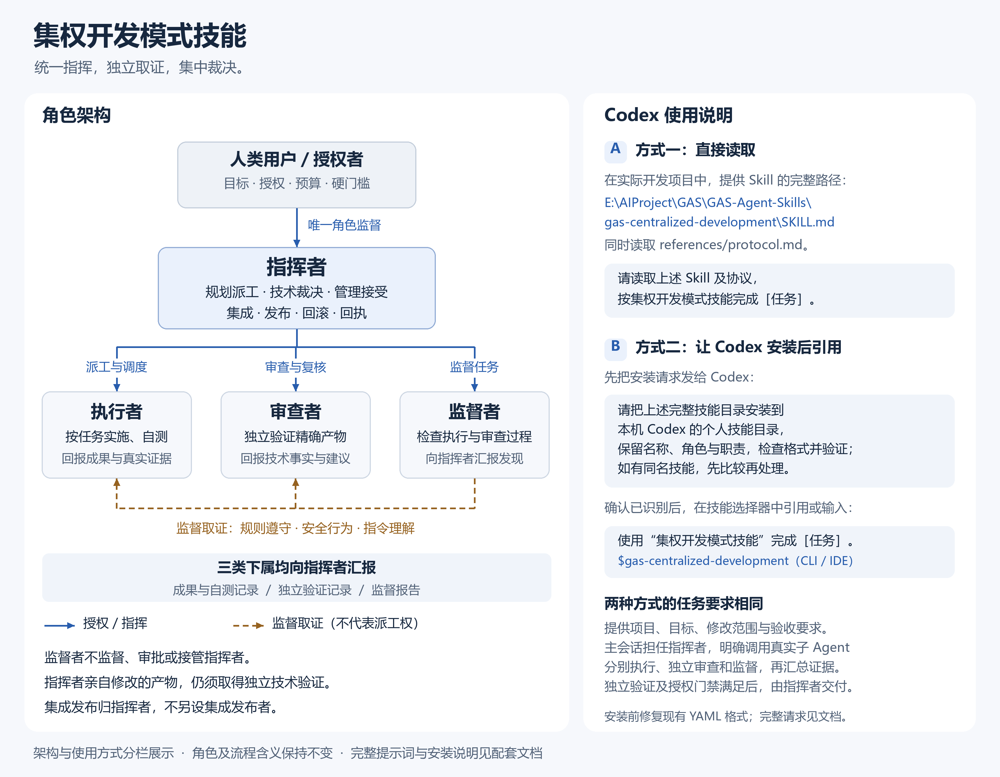
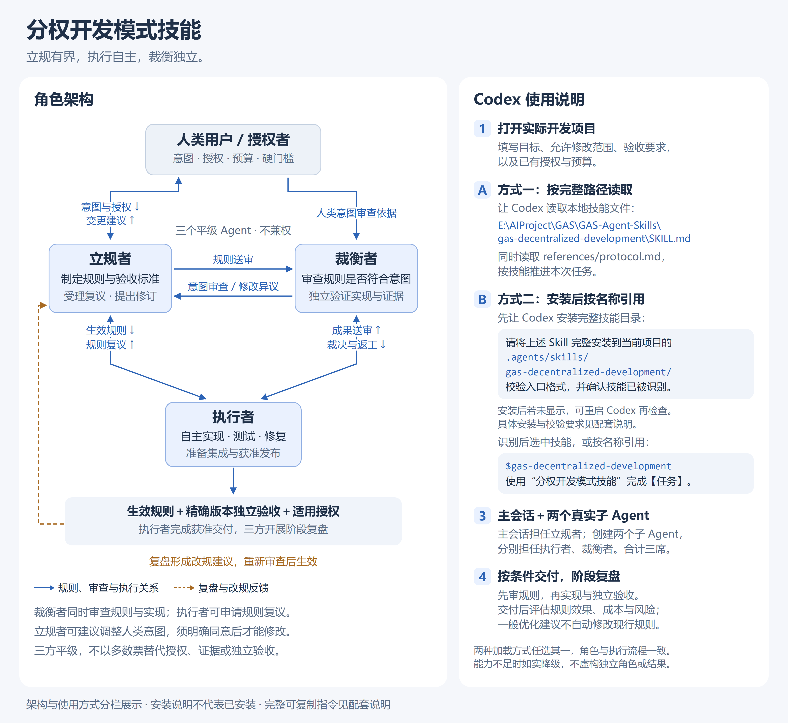
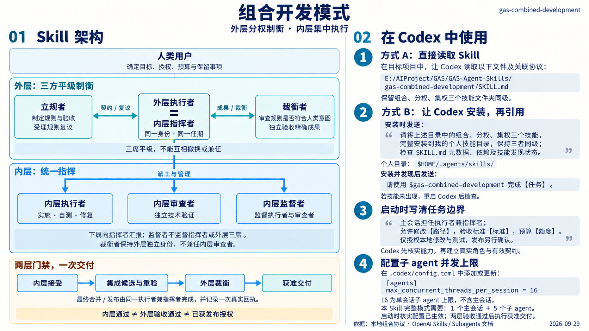

<div align="center">

# GAS · Agent Skills

**简体中文 | [English](README.en.md)**

### 让 AI 团队有章法地协作。

**集权统一指挥 · 分权独立制衡 · 组合内外协同**

[](https://github.com/Geruyang/GAS-Agent-Skills/actions/workflows/validate.yml)

为多 Agent 开发设计的三种协作模式，让任务分工、决策边界、独立验收与最终交付都有据可循。

[集权模式](#01-集权模式) · [分权模式](#02-分权模式) · [组合模式](#03-组合模式) · [快速开始](#快速开始) · [验证记录](GAS-Agent-Skills/VALIDATION.md) · [参与贡献](CONTRIBUTING.md) · [讨论区](https://github.com/Geruyang/GAS-Agent-Skills/discussions)

</div>

> **验证状态：本项目尚未在实际工程项目中进行充分验证。** 当前通过的检查主要覆盖文件结构、模板、校验器和安装流程，不代表三种模式在真实开发中的效果、效率与稳定性已经得到验证。欢迎大家一起参与实际项目验证，分享成功经验、失败案例和改进建议。

---

多个 Agent 一起写代码，谁来定规则？谁来派任务？谁有权判断“已经完成”？

**GAS 把这些问题写成可读取、可复用、可核验的开发协议。** 从统一指挥，到三方制衡，再到两层组合，你可以根据任务的耦合程度和治理需求，选择一套清晰的协作方式。

每种模式都提供 **Skill 入口、协作协议、JSON 记录模板与压力场景**；仓库同时提供三张完整框架图、复制安装脚本和标准库离线检查，供支持读取 Skill 与真实子 Agent 的开发环境使用。

## 01 集权模式

### 一个指挥中枢，把规划、执行与交付串起来。

**统一指挥，独立取证，集中裁决。** 指挥者拆解任务、统一派工、汇总技术事实，并负责集成发布；执行者、审查者、监督者各司其职，向指挥者汇报。

[](docs/images/01-centralized.png)

**适用场景：** 跨模块重构、依赖紧密的功能开发、共享接口频繁变化、需要统一优先级的交付。

- **执行者**负责实施与自测；**审查者**独立验证成果；**监督者**检查执行与审查过程。
- 指挥者亲自修改的成果同样需要独立技术验证，管理接受与实际发布分别记录。
- 监督者监督执行者与审查者；指挥者的角色监督者是人类。

[阅读 Skill](GAS-Agent-Skills/gas-centralized-development/SKILL.md) · [协作协议](GAS-Agent-Skills/gas-centralized-development/references/protocol.md) · [记录模板](GAS-Agent-Skills/gas-centralized-development/templates) · [48 个压力场景](GAS-Agent-Skills/gas-centralized-development/evals/scenarios.json)

## 02 分权模式

### 定规则、做实现、判结果，交给三个独立席位。

**立规有界，执行自主，裁衡独立。** 立规者制定规则与验收标准，执行者在有效契约内自主实施，裁衡者独立检查规则是否忠实于人类意图、成果是否满足验收要求。

[](docs/images/02-decentralized.png)

**适用场景：** 边界与接口明确、强调独立验收、需要防止实现者自行降低标准的任务。

- 三方平级，分别承担立规、执行、裁衡，**不兼权**。
- 执行者可以申请规则复议；裁衡者同时审查规则与实现，避免“按错误规则正确执行”。
- 交付后的阶段复盘形成改规建议，经过既有流程审查后生效。

[阅读 Skill](GAS-Agent-Skills/gas-decentralized-development/SKILL.md) · [协作协议](GAS-Agent-Skills/gas-decentralized-development/references/protocol.md) · [记录模板](GAS-Agent-Skills/gas-decentralized-development/templates) · [32 个压力场景](GAS-Agent-Skills/gas-decentralized-development/evals/scenarios.json)

## 03 组合模式

### 外层守住目标与标准，内层组织复杂实施。

**外层分权制衡，内层集中执行。** 外层保留立规者、执行者、裁衡者三个平级席位；其中的执行者同时担任内层指挥者，组织执行、审查与监督团队。

[](docs/images/03-combined.png)

**适用场景：** 同时需要跨模块统一实施和外部独立验收的复杂开发任务。

- **外层执行者 = 内层指挥者**：同一身份、同一任期，承担最终集成发布责任。
- **两层门禁，一次交付**：内层接受 → 集成候选与必要重验 → 外层独立裁衡 → 获准交付。
- 完整默认配置需要 **6 个独立身份（含主会话）**；内层通过不能替代外层验收。

[阅读 Skill](GAS-Agent-Skills/gas-combined-development/SKILL.md) · [组合协议](GAS-Agent-Skills/gas-combined-development/references/protocol.md) · [运行模板](GAS-Agent-Skills/gas-combined-development/templates/run.example.json) · [架构与使用详解](GAS-Agent-Skills/gas-combined-development/references/architecture-guide.md)

> 点击任意框架图可查看原图。图中的 `E:/AIProject/GAS/...` 是作者本机路径示例，使用时替换为你的克隆路径；集权图底部的 YAML 修复提示属于制图时的历史状态，当前发布文件已修复。

## 怎样选择

| 模式 | 核心机制 | 典型角色配置（含主会话） | 适合优先解决的问题 |
| --- | --- | --- | --- |
| **集权** | 指挥者统一派工与裁决 | 指挥者 + 执行者 + 审查者 + 监督者 | 依赖协调、优先级统一、集成交付 |
| **分权** | 立规、执行、裁衡三方平级 | 3 个独立身份，单执行席 | 规则与实现分离、意图一致性、独立验收 |
| **组合** | 外层分权，执行席内嵌集权团队 | 默认 6 个独立身份 | 复杂实施与独立制衡同时成立 |

模式选择是工程设计建议，尚无本项目的实测性能排名。普通小改动可按实际需要选择更轻的流程。

## 快速开始

### 1. 获取项目

```bash
git clone https://github.com/Geruyang/GAS-Agent-Skills.git
cd GAS-Agent-Skills
```

也可通过 GitHub 的 **Code → Download ZIP** 下载并完整解压。

### 2. 直接读取一种模式

在你的目标开发项目中，让 Agent 读取对应入口和协议。将下面的路径改为本机绝对路径，再填写任务与验收标准：

```text
请读取【本仓库绝对路径】/GAS-Agent-Skills/gas-centralized-development/SKILL.md，
以及它引用的 references/protocol.md，按集权开发模式完成【具体任务】。

允许修改：【文件或模块】。
验收标准：【可执行的检查与预期结果】。
预算与停止条件：【时间、调用次数或其他边界】。
请先核实真实子 Agent 能力与可用席位，登记角色、任务和证据，
复用本次已有授权，并如实区分自测、独立验收、集成与发布状态。
```

使用分权模式时，将入口改为 `gas-decentralized-development/SKILL.md`、模式改为“分权”；使用组合模式时，改为 `gas-combined-development/SKILL.md`、模式改为“组合”，并读取它要求的两个同级技能与协议。

### 3. 按需复制安装

三个技能目录保留同级关系；集权、分权可以分别使用，组合依赖二者。可以复制完整文件夹到所用宿主支持的技能目录，也可用 PowerShell 将三者复制到一个明确的绝对路径：

```powershell
# 先查看复制计划；将路径替换为你的目标目录
powershell -NoProfile -File .\GAS-Agent-Skills\Install-GAS-Skills.ps1 -Destination 'D:\AgentSkills' -WhatIf

# 确认路径后复制，已有同名技能时停止，不覆盖
powershell -NoProfile -File .\GAS-Agent-Skills\Install-GAS-Skills.ps1 -Destination 'D:\AgentSkills'
```

脚本负责校验与复制，宿主的技能发现、子 Agent 能力和并发限制需在使用环境中确认。[查看完整安装说明](GAS-Agent-Skills/README.zh-CN.md)。

## 仓库导航

```text
GAS-Agent-Skills/
├── README.md                          # 中文展示与快速开始
├── README.en.md                       # English overview
├── docs/
│   ├── images/                        # 集权 → 分权 → 组合，三张原始高清图
│   └── history/                       # 历史验证说明
└── GAS-Agent-Skills/                  # 可复制的完整技能包
    ├── gas-centralized-development/  # 集权：指挥、执行、审查、监督
    ├── gas-decentralized-development/ # 分权：立规、执行、裁衡
    ├── gas-combined-development/     # 组合：外层分权 + 内层集权
    ├── Install-GAS-Skills.ps1         # 三技能复制安装器
    ├── verify_bundle.py              # 包结构与 SHA-256 校验
    ├── tests/                        # 校验器回归测试
    └── VALIDATION.md                 # 本次验证结果与覆盖边界
```

## 本地验证

Python **3.9+**，仅使用标准库。在仓库根目录执行：

```bash
python -B GAS-Agent-Skills/verify_bundle.py
python -B -m unittest discover -s GAS-Agent-Skills/tests -v
python -B GAS-Agent-Skills/gas-centralized-development/scripts/validate_skill.py
python -B -m unittest discover -s GAS-Agent-Skills/gas-centralized-development/tests -v
```

GAS 交付的是协作协议、模板与检查工具。真实调度、权限隔离与发布能力来自宿主环境。离线检查验证文件和声明；行为场景保持 `NOT_RUN`，不把静态通过写成多 Agent 工程实测。详细范围见 [验证记录](GAS-Agent-Skills/VALIDATION.md)。

## 一起参与实际项目验证

GAS 目前仍处于探索与验证阶段。**三种模式在不同模型、宿主环境和任务规模下的实际表现，还需要更多真实项目的检验。** 我们希望与使用者一起，逐步确认哪些规则有效、哪些流程增加了协调成本，以及哪些场景需要调整。

欢迎在 [Discussions](https://github.com/Geruyang/GAS-Agent-Skills/discussions) 交流用法和验证经验，通过 [GitHub Issues](https://github.com/Geruyang/GAS-Agent-Skills/issues/new/choose) 提交验证报告、问题或建议，或通过 Pull Request 补充案例与改进。具体步骤见 [中文贡献指南](CONTRIBUTING.md)。

- **说明环境与任务：** 所用模型、Agent 宿主、技能版本、协作模式、实际角色数量，以及任务目标和规模。
- **记录过程与证据：** 验收标准、执行与审查记录、耗时及调用成本；条件允许时，与不使用本技能的同类任务进行对照。
- **如实报告结果：** 哪些步骤有效、哪里失败或停滞、是否发生角色越权或重复返工，以及仍未验证的部分。成功与失败案例同样有价值。

可以先从一个边界明确、结果可核验的小任务开始。提交记录时请注明实际执行了哪些步骤，区分静态检查、文字推演与真实多 Agent 工程运行，帮助大家共同积累可信的验证证据。

## 许可证

本项目采用 [MIT 许可证](LICENSE)，允许使用、修改、分发和商用，需保留版权及许可声明。项目仍需更多实际工程验证，欢迎共同完善。

---

**让每一次派工有边界，每一个结论有证据，每一次交付有依据。**
